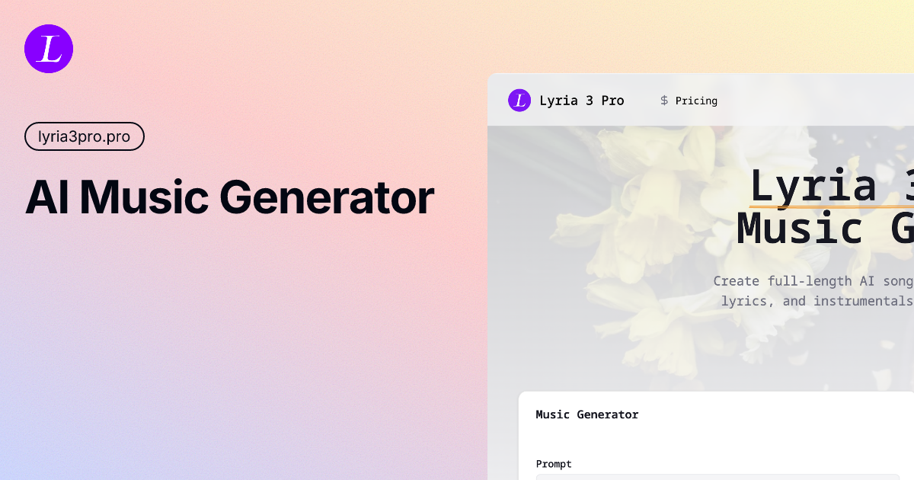

# 🎵 Free AI Music Generator — Lyria 3 Pro (Google DeepMind)

Create full-length songs with vocals, lyrics, and instrumentals in seconds — powered by Google Lyria 3 Pro. The ultimate AI music solution for creators, musicians, and developers.

We offer [a full-featured web app](https://lyria3pro.pro/) for seamless music creation, supporting multiple AI models including Lyria 3 Pro, Suno V5, V4.5, V4, and more.

**Professional AI Music Generator Platform**

Our web app makes music creation effortless, with powerful AI models, intuitive controls, and a clean, user-friendly interface designed for everyone. [Try it now](https://lyria3pro.pro/).

## ✨ Features

**Lyria 3 Pro** is Google DeepMind's most advanced music generation model. It produces high-quality, full-length songs with vocals, lyrics, and instrumentals from simple text prompts.

With this cutting-edge model at the core, our app unlocks a suite of powerful features designed to make music creation effortless and inspiring:

- 🌐 **Full-Featured Web App** — Seamless UI for creating and downloading AI-generated music.
- 📝 **Text-to-Music Generation** — Generate complete songs from simple text prompts with vocals, lyrics, and instrumentals.
- 🎤 **Multiple AI Models** — Choose from Lyria 3 Pro, Suno V5, Suno V4.5, Suno V4, Suno V3.5, and more.
- 🎼 **Full-Length Songs** — Generate tracks up to 3 minutes long, not just short clips.
- 📥 **MP3 Download** — Download your generated tracks instantly in MP3 format.
- 🎨 **No Music Skills Required** — Anyone can create professional-sounding music with just a text description.
- 💰 **Flexible Pricing** — Pay-as-you-go credits or monthly/annual subscriptions.

## 🎯 Usage Guide

### 🎵 Creating Music

1. **Choose Model** — Select an AI model (e.g. _Lyria 3 Pro_, _Suno V5_).
2. **Enter a Prompt** — Write a clear description of the music you want (genre, mood, instruments, lyrics, etc.).
3. **Generate** — Click **Generate** to start. After a short moment, your track will appear in the player.
4. **Download** — Download your generated song as MP3.

### 💡 Tips for Best Results

- ✍️ **Be specific**: Describe the genre, mood, tempo, instruments, and vocal style.
- 🎸 **Include genre tags**: Try "pop", "rock", "jazz", "electronic", "hip-hop", "classical", etc.
- 🎤 **Specify vocals**: Mention "male vocals", "female vocals", or "instrumental only".
- 🎼 **Add lyrics**: Include your own lyrics in the prompt for custom songs.
- ⚡ **Try different models**: Each model has its own strengths — experiment to find your favorite.

## 🖼️ Results & Examples

See the power of AI music generation in action. Create songs across any genre with just a text prompt.

> ⚡ The results above were generated using **Lyria 3 Pro (Google DeepMind)** on our web app.

## 💰 Pricing

| Plan | Price | Credits | Duration |
|------|-------|---------|----------|
| Credits Package | $19.90 | 50 credits | 1 year |
| Starter (Monthly) | $19.90/mo | 60 credits | Monthly |
| Premium (Annual) | $119.90/yr | 720 credits | 1 year |

## 🤝 Contributing

We warmly welcome contributions in the form of:

- 💡 **Feature Suggestions** — Share ideas to improve or expand the app's capabilities.
- 🛠 **Enhancements** — Propose improvements to performance, UI/UX, or AI model usage.
- 🐞 **Bug Reports** — Help us identify and fix issues to ensure a smooth user experience.
- 📈 **Collaboration** — We are open to discussions about potential partnerships or integrations.

👉 If you'd like to contribute, please reach out via **Issues**.

## 🔗 Links & Resources

- 🌐 **Website:** [https://lyria3pro.pro](https://lyria3pro.pro/)
- 🎵 **AI Music Generator:** [https://lyria3pro.pro/generate](https://lyria3pro.pro/generate)
